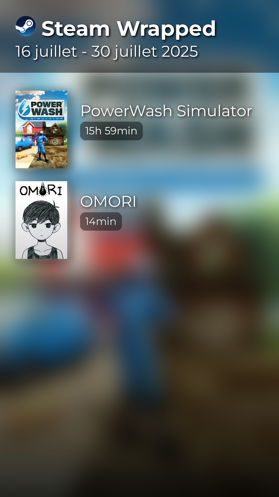

# 🎮 Steam Wrapped

Generate beautiful visual summaries of your Steam gaming activity, similar to Spotify Wrapped.



## ✨ Features

- 📊 Generate Instagram-story style images of your gaming activity
- 🎯 Highlights games played in the last 2 weeks
- 🎨 Professional graphics with shadows, gradients, and Steam branding
- 📱 Social media ready (1080x1920 resolution)

## 🚀 Quick Start

1. **Get Steam credentials** ([detailed guide](docs/ENV_SETUP.md)):
   - Steam Web API key from [here](https://steamcommunity.com/dev/apikey)
   - Your Steam User ID from your profile URL

2. **Setup and run**:
   ```bash
   git clone <repository-url>
   cd steam-wrapped
   pip install pdm && pdm install
   cp env.example .env  # Edit with your credentials
   pdm run python main.py
   ```

## 📚 Documentation

- **[⚙️ Configuration](docs/ENV_SETUP.md)** - Environment setup guide
- **[🔧 API Reference](docs/API.md)** - Services and models documentation
- **[👩‍💻 Development](docs/DEVELOPMENT.md)** - Setup, workflow, and contributing

## 🤝 Contributing

Contributions welcome! See our [Development Guide](docs/DEVELOPMENT.md) for setup and guidelines.

## 📜 License

MIT License - see [LICENSE](LICENSE) for details.

---

*Unofficial project - not affiliated with Valve Corporation or Steam.*